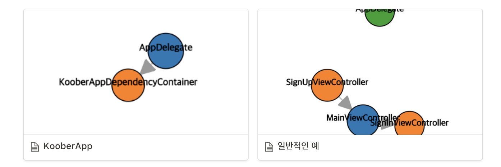
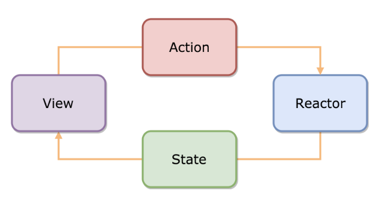

# iOS 스터디 (19.07.08)

## Advanced iOS App Architecture

Ch.5 MVVM 

[Dependency Visualize Graph](https://www.notion.so/eaff8283d12342b79528f776abf2f5c8)
    
- 의견
    - KooberApp 같은 경우, 컴파일 타임에 AppDelegate 내에서는 KooberAppDependencyContainer하고만 의존성관계를 갖고있음. 이후 로직은 런타임 상황에 따라 작성한 로직, 필요한 부분을 주입 하여 사용하기 때문에 관리가 수월함(?)
    - 일반적인 케이스는 MainViewController만 등장하지만, SignUp,SignIn VC와 데이터를 주고받는 등의 역할 수행을 통해 의존성이 연결된 상태로 나타남. 유저 입장에서 아직 SignUp,SignIn화면으로 진입하지 않았지만 해당 항목들을 미리 연결되어 있는 부분이 낭비라고 생각이 듬

### MVVM - ViewModel

- **ViewModel 추상화된 View의 Model이고, View의 상태를 스테이트 머신처럼 다루며 UI의존적이지 않음.**
- ViewModel의 인터페이스를 통해 ViewModel과 의존적인 Model에 대해 테스트를 쉽게할 수 있습니다.
- View는 ViewModel의 인터페이스와 바인딩(Binding)되어야 합니다.ViewModel를 개발하고 View를 디자이너의 영역이라고 가정하고 ViewModel과 View가 각자 완성되었을때 이 두를 잇는게 바인딩입니다.
- 바인딩을 통해 View와 ViewModel은 항상 동일한 상태를 갖게 됩니다. 바인딩을 위해서는 기술적인 도움이 필요합니다.
- Bind하는 과정에서 Rx가 필수적으로 사용됨
- 뷰의 상태를 정의해놓고, bind,관찰하는 예

    public enum PickMeUpView {
    	case initial
    	case selectDropoffLocation
    	case selectRideOption
    	case confirmRequest
    	case sendingRideRequest
    }
    
    public class PickMeUpViewModel {
    	public var view: Observable<PickMeUpView> { return viewSubject.asObservable() }
    	private let viewSubject: BehaviorSubject<PickMeUpView> 
    }
    

- MVVM 패턴사용시 뷰 컨트롤러 기능에 따라 ViewModel이 방대하게 커지게 되는데 어떻게 추가적으로 분리하여 사용하는가
    - Network Provider사용을 통한 분리
    - Repository, Manager 같은 기능별 관리 객체를 생성하여 분리
- ReactorKit 단방향 프레임워크? ([https://github.com/ReactorKit/ReactorKit](https://github.com/ReactorKit/ReactorKit))

    

    - `View`는 `Action`으로 전송만 하고, `State`로부터 결과를 전달받는다
    - `Action, State` 가 없다면 `View와 Reactor` 서로 송신,수신하는 역할을 담당하게되는데 이것을 분리시켜줌으로써 단방향 흐름을 만들었다고 할 수 있음.

* Notion -> md 이상적이지 않다
